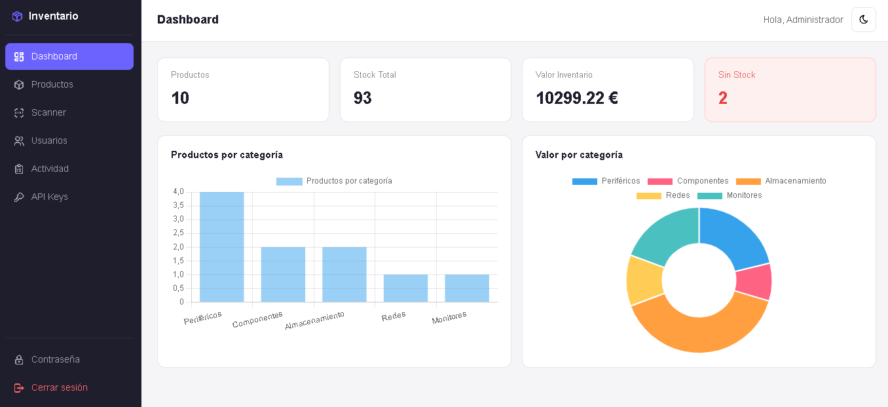
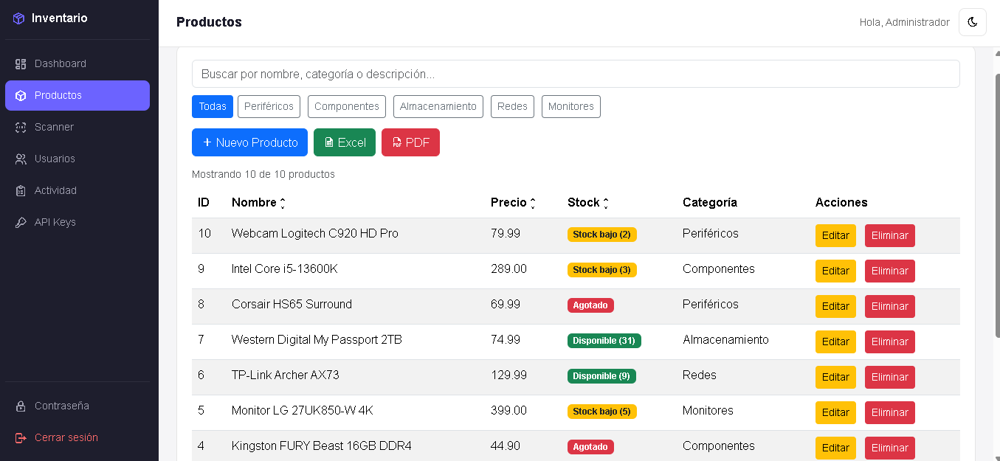
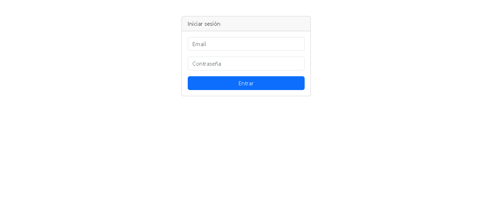
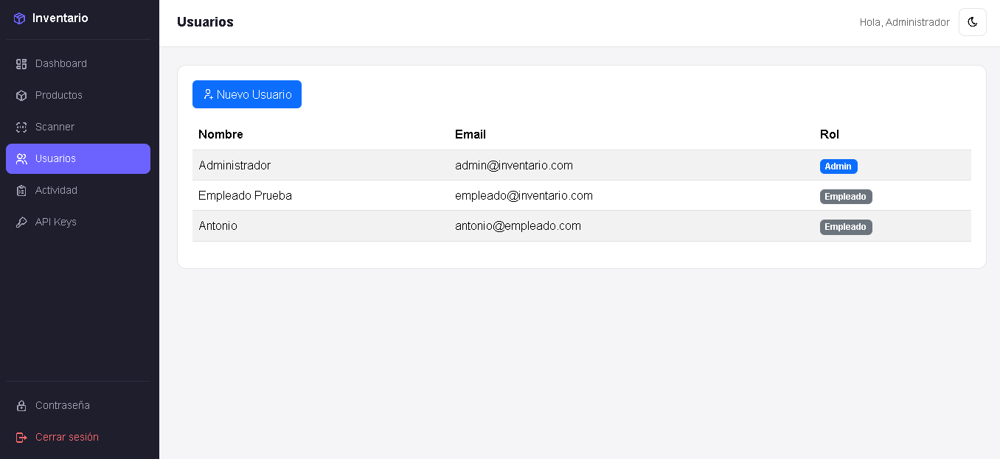
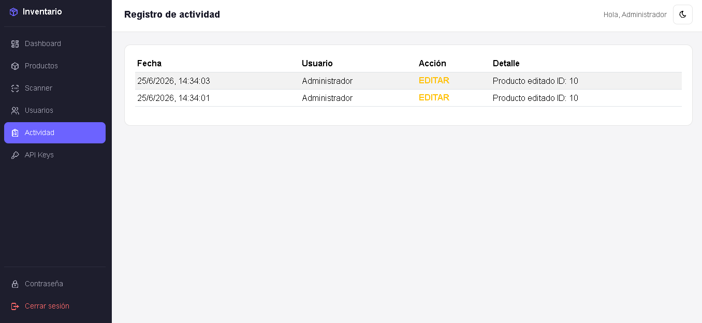
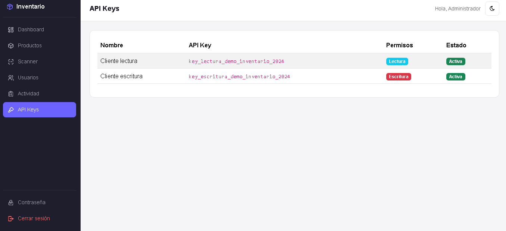
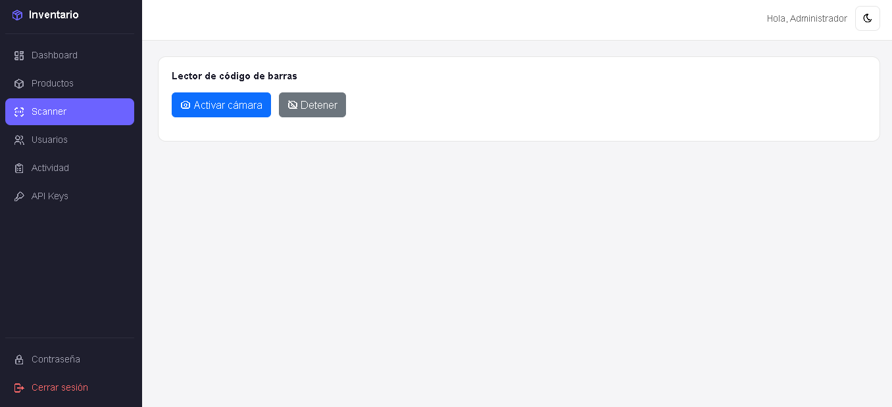

# Gestor de Inventario

Aplicación web de gestión de inventario desarrollada con PHP, MySQL y JavaScript vanilla. Proyecto de portfolio desarrollado tras finalizar el Grado Superior de Desarrollo de Aplicaciones Web (DAW).

## Capturas

**Dashboard**



**Gestión de productos**



**Inicio de sesión**



**Gestión de usuarios**



**Registro de actividad**



**API Keys**



**Lector de código de barras**



---

## Características

- Autenticación con sesiones PHP (login / logout)
- Roles de usuario — Admin y Empleado con permisos diferenciados en frontend y backend
- CRUD completo de productos con stock mínimo configurable por producto
- Alertas automáticas por email cuando el stock baja del mínimo (PHPMailer + Gmail SMTP)
- Dashboard con métricas en tiempo real (total productos, stock total, valor de inventario, productos sin stock)
- Indicadores visuales de stock (Agotado / Stock bajo / Disponible) basados en el stock mínimo de cada producto
- Gráficas de productos y valor por categoría (Chart.js)
- Buscador en tiempo real
- Filtros por categoría dinámicos
- Ordenación por columnas
- Paginación
- Lector de código de barras integrado con ajuste de stock, disponible para admin y empleado (QuaggaJS — requiere HTTPS o localhost)
- API REST pública con autenticación por API key (permisos de lectura y escritura)
- Panel de consulta de API keys (solo administrador)
- Registro de actividad — logs de creación, edición y eliminación con usuario y fecha
- Registro de nuevos usuarios desde la aplicación (solo administrador)
- Cambio de contraseña
- Exportación a Excel y PDF
- Modo oscuro
- Diseño responsive con sidebar lateral

---

## Tecnologías

**Frontend**
- HTML5, CSS3, JavaScript ES6+
- Bootstrap 5.3
- Chart.js
- SweetAlert2
- QuaggaJS

**Backend**
- PHP 8
- PDO
- Sesiones PHP
- PHPMailer

**Base de datos**
- MySQL / MariaDB

---

## Requisitos

- XAMPP con Apache y MySQL
- PHP 8 o superior

---

## Instalación

**1. Clonar el repositorio**

```bash
git clone https://github.com/alejoluque2002/inventario-app.git
```

**2. Mover a htdocs**

Copia la carpeta `inventario-app` dentro de `C:\xampp\htdocs\`.

**3. Crear la base de datos**

Abre phpMyAdmin e importa el script (crea la base de datos `inventario_db` y las tablas):

```
database/schema.sql
```

> ¿Ya tenías una instalación anterior? No ejecutes `schema.sql`: haz una copia de seguridad y aplica `database/migrations/001_endurecer_esquema.sql`.

**4. Configurar el entorno (`.env`)**

Copia `.env.example` como `.env` en la raíz del proyecto y rellena tus valores:

```
DB_HOST=localhost
DB_NAME=inventario_db
DB_USER=inventario_user
DB_PASS=una_contraseña_larga

MAIL_USER=tu_cuenta@gmail.com
MAIL_PASS=contraseña_de_aplicación
ALERT_EMAIL=quien_recibe_las_alertas@ejemplo.com
```

- Crea un usuario de MySQL con permisos solo sobre `inventario_db` (no uses `root`):
  ```sql
  CREATE USER 'inventario_user'@'localhost' IDENTIFIED BY 'una_contraseña_larga';
  GRANT SELECT, INSERT, UPDATE, DELETE ON inventario_db.* TO 'inventario_user'@'localhost';
  ```
- Si no existe `.env`, la app usa `root` sin contraseña (solo válido para desarrollo local).
- Para el email genera una contraseña de aplicación en https://myaccount.google.com/apppasswords. Si `MAIL_USER`/`MAIL_PASS` están vacíos, las alertas por email se desactivan.
- `.env` está en `.gitignore`. **Nunca lo subas al repositorio.**

**5. Crear el primer administrador**

Desde la terminal, en la carpeta del proyecto (en XAMPP: `C:\xampp\php\php.exe`):

```bash
php database/crear_admin.php "Tu Nombre" tu@email.com
```

Te pedirá la contraseña (8-72 caracteres). No hay usuarios ni contraseñas por defecto.

**6. Configurar virtual host**

Añade en `C:\xampp\apache\conf\extra\httpd-vhosts.conf`:

```apache
<VirtualHost *:80>
    DocumentRoot "C:/xampp/htdocs/inventario-app"
    ServerName inventario.local

    <Directory "C:/xampp/htdocs/inventario-app">
        AllowOverride All
        Require all granted
    </Directory>
</VirtualHost>
```

`AllowOverride All` es necesario para que se apliquen los `.htaccess` que protegen `.env`, `.git` y las carpetas internas del backend.

Añade en `C:\Windows\System32\drivers\etc\hosts`:

```
127.0.0.1 inventario.local
```

**7. Acceder a la aplicación**

```
http://inventario.local/frontend/login.html
```

---

## API REST

La aplicación incluye una API pública accesible sin sesión, autenticada mediante API key.

**Base URL:**
```
http://inventario.local/backend/api/public/
```

**Autenticación por header:**
```
X-API-Key: tu_api_key
```

**O por query parameter:**
```
?api_key=tu_api_key
```

**Crear una API key** (por ahora se gestionan desde SQL; el panel de la app solo las lista):

```sql
INSERT INTO api_keys (nombre, api_key, permisos)
VALUES ('Mi integración', SUBSTRING(SHA2(CONCAT(UUID(), RAND()), 256), 1, 40), 'lectura');
```

`permisos` puede ser `lectura` o `escritura`. Usa siempre la cabecera `X-API-Key`; el parámetro `?api_key=` se mantiene por compatibilidad, pero las URLs acaban en logs. Las escrituras hechas con API key quedan registradas en el registro de actividad.

**Endpoints disponibles:**

| Método | Endpoint | Descripción | Permisos |
|--------|----------|-------------|----------|
| GET | /productos.php | Listar todos los productos | Lectura |
| GET | /productos.php?id=1 | Obtener producto por ID | Lectura |
| POST | /productos.php | Crear producto | Escritura |
| PUT | /productos.php?id=1 | Actualizar producto | Escritura |
| DELETE | /productos.php?id=1 | Eliminar producto | Escritura |

---

## Estructura del proyecto

```
inventario-app/
├── frontend/
│   ├── index.html
│   ├── login.html
│   ├── css/
│   │   └── style.css
│   └── js/
│       ├── config.js
│       ├── app.js
│       ├── auth.js
│       ├── login.js
│       └── logout.js
├── backend/
│   ├── api/
│   │   ├── public/
│   │   │   ├── productos.php
│   │   │   └── README.md
│   │   ├── productos.php
│   │   ├── usuarios.php
│   │   ├── logs.php
│   │   └── apikeys.php
│   ├── auth/
│   │   ├── login.php
│   │   ├── logout.php
│   │   ├── register.php
│   │   ├── check_auth.php
│   │   ├── protect.php
│   │   ├── session.php
│   │   ├── rate_limit.php
│   │   ├── api_auth.php
│   │   └── change_password.php
│   ├── config/
│   │   ├── bootstrap.php
│   │   └── database.php
│   ├── models/
│   │   ├── producto.php
│   │   └── log.php
│   ├── services/
│   │   ├── alertas.php
│   │   └── mailer.php
│   └── libs/
│       └── PHPMailer/
├── database/
│   ├── schema.sql
│   ├── crear_admin.php
│   └── migrations/
├── .env.example
└── .htaccess
```

---

## Seguridad

**Implementado**

- Consultas preparadas (PDO) en todo el backend y validación de tipos, rangos y longitudes de los datos
- Escapado de HTML en el frontend (XSS) y en los emails de alerta
- Contraseñas con `password_hash()` (bcrypt), longitud 8-72 y verificación en tiempo constante frente a usuarios inexistentes
- Sesiones: cookie `HttpOnly` + `SameSite=Lax` (+ `Secure` bajo HTTPS), `session_regenerate_id()` al iniciar sesión y al cambiar la contraseña, y logout que destruye la cookie
- Protección CSRF: las peticiones que modifican datos exigen la cabecera `X-Requested-With` (además de `SameSite`)
- Límite de intentos de login: 5 fallos por email+IP => bloqueo de 15 minutos
- Control de acceso por rol en el backend (no solo en la interfaz)
- Credenciales (BD y SMTP) fuera del código, en `.env` (ignorado por git)
- Errores internos registrados en el log del servidor; el cliente solo recibe un mensaje genérico
- `.htaccess` que bloquea el acceso web a `.env`, `.git` y a `config/`, `models/`, `services/` y `libs/`
- Registro de actividad también para las escrituras hechas con API key

**Limitaciones conocidas / siguiente paso**

- Las API keys se guardan en claro en la base de datos (lo ideal es guardar solo su hash y mostrarlas una vez al crearlas) y no hay rate limiting en la API pública
- Las librerías del frontend se cargan desde CDN sin SRI (hashes de integridad)
- Falta una Content-Security-Policy (los `onclick` en línea del HTML la impiden por ahora)
- Se recomienda servir la aplicación bajo HTTPS en cualquier entorno que no sea local


---

## Autor

Alejandro Luque Núñez
Técnico Superior en Desarrollo de Aplicaciones Web
[github.com/alejoluque2002](https://github.com/alejoluque2002)